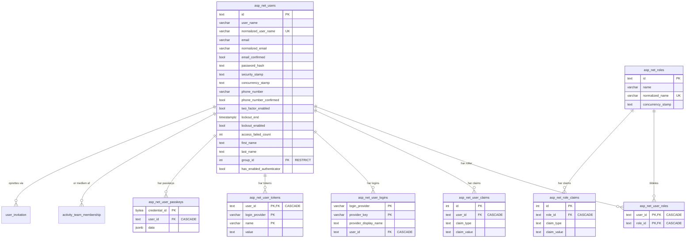
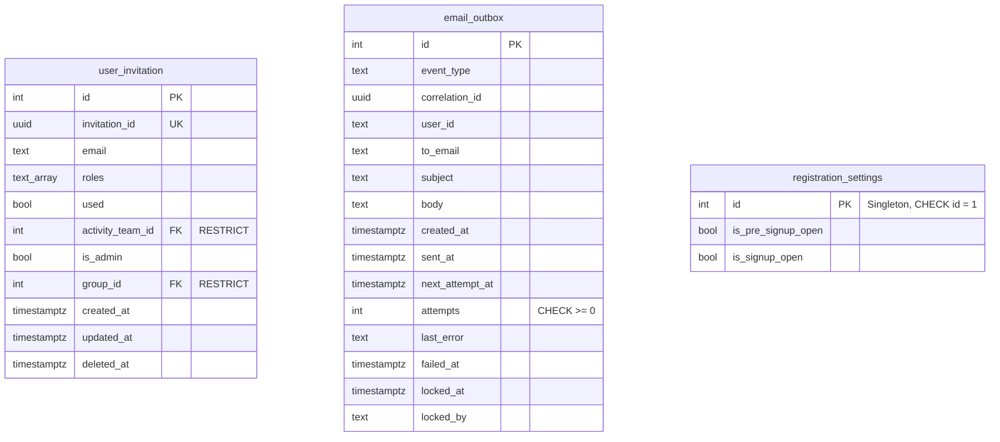
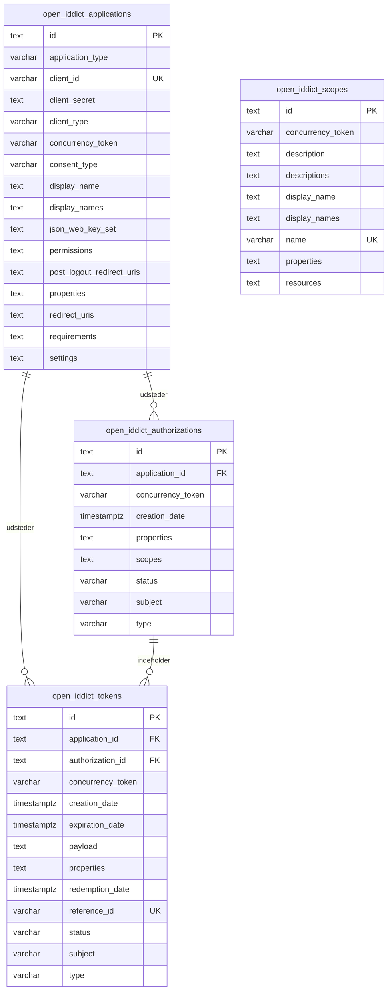

# Database diagram

Schema `ds28` (PostgreSQL). Alle tabeller ligger i schema `ds28` og bruger
snake_case. Kilden er `DS/Data/DataDbContext.cs`, `DS/Data/Configurations/*.cs`
og `DS/Migrations/*.sql`.

## Domene

```mermaid
erDiagram
    scout_group {
        int id PK
        text name
        text district "DANEHOF | FIONIA"
        timestamptz created_at
        timestamptz updated_at
        timestamptz deleted_at
    }

    scout {
        int id PK
        text name
        date birthday
        text gender "MALE | FEMALE"
        int group_id FK "RESTRICT"
        timestamptz created_at
        timestamptz updated_at
        timestamptz deleted_at
    }

    patrol {
        int id PK
        text name
        int group_id FK "CASCADE"
    }

    patrol_membership {
        int id PK
        int scout_id FK "CASCADE"
        int patrol_id FK "CASCADE"
        timestamptz joined_date
        bool is_patrol_leader
    }

    group_pre_signup {
        int id PK
        int group_id FK "CASCADE, UNIQUE"
        int beaver
        int wolf
        int junior
        int trop
        int senior
        int rover
        int leader
    }

    scout_signup {
        int id PK
        date day
        int scout_id FK "CASCADE, UNIQUE(scout_id, day)"
    }

    activity_team {
        int id PK
        text name
        timestamptz created_at
        timestamptz updated_at
        timestamptz deleted_at
    }

    activity {
        int id PK
        text name
        int activity_team_id FK "RESTRICT"
        timestamptz created_at
        timestamptz updated_at
        timestamptz deleted_at
    }

    activity_budget {
        int id PK
        int budget "CHECK >= 0"
        int activity_id FK "CASCADE, UNIQUE"
    }

    catalog_data {
        int id PK
        text name
        text summary
        text description
        int activity_id FK "CASCADE, UNIQUE"
    }

    activity_category {
        int id PK
        text name "UNIQUE"
    }

    catalog_data_category {
        int catalog_data_id PK,FK "CASCADE"
        int activity_category_id PK,FK "CASCADE"
    }

    activity_timeslots {
        int id PK
        int activity_id FK "RESTRICT"
        timestamptz start_time
        int duration "CHECK >= 1"
    }

    scout_activity_timeslot {
        int activity_timeslot_id PK,FK "CASCADE"
        int scout_id PK,FK "CASCADE"
    }

    activity_team_membership {
        int id PK
        text user_id FK "CASCADE"
        int activity_team_id FK "CASCADE"
        bool is_admin
    }

    material {
        int id PK
        text name
        numeric price "CHECK >= 0"
        text url
        timestamptz created_at
        timestamptz updated_at
        timestamptz deleted_at
    }

    material_order {
        int id PK
        int activity_id FK "RESTRICT"
        int material_id FK "RESTRICT"
        int quantity "CHECK > 0"
        timestamptz use_date
        timestamptz created_at
        timestamptz updated_at
        timestamptz deleted_at
    }

    scout_group ||--o{ scout : "har medlemmer"
    scout_group ||--o{ patrol : "har patruljer"
    scout_group ||--o| group_pre_signup : "har forudtilmelding"
    scout_group ||--o{ asp_net_users : "har brugere"
    scout_group ||--o{ user_invitation : "har invitationer"
    scout ||--o{ patrol_membership : "er med i"
    patrol ||--o{ patrol_membership : "har medlemmer"
    scout ||--o{ scout_signup : "tilmelder sig"
    scout ||--o{ scout_activity_timeslot : "tilmelder sig"
    activity_team ||--o{ activity : "arrangerer"
    activity_team ||--o{ activity_team_membership : "har medlemmer"
    activity ||--o| activity_budget : "har budget"
    activity ||--o| catalog_data : "har katalogdata"
    activity ||--o{ activity_timeslots : "har tidspunkter"
    activity ||--o{ material_order : "bestiller"
    activity_timeslots ||--o{ scout_activity_timeslot : "tilmeldes af"
    catalog_data ||--o{ catalog_data_category : "kategoriseres af"
    activity_category ||--o{ catalog_data_category : "indeholder"
    material ||--o{ material_order : "bestilles i"
```

## Brugere og roller

## Drift og invitationer

`email_outbox.user_id` har ingen foreign key, da en udsendelse kan ske til en
inviteret adresse uden brugerkonto.

## OpenIddict

## Bemærkninger

- Soft delete via `deleted_at` på `scout_group`, `scout`, `activity_team`,
  `activity`, `material` og `material_order`.
- Migration `006a_relax_legacy_nullable.sql` gør flere kolonner nullable,
  bl.a. `scout_group.name`, `scout.name`, `activity.name` og
  `email_outbox.to_email`.
- `scout_activity_timeslot` findes i databasen, men har ingen tilsvarende
  entitet i `DataDbContext`.
